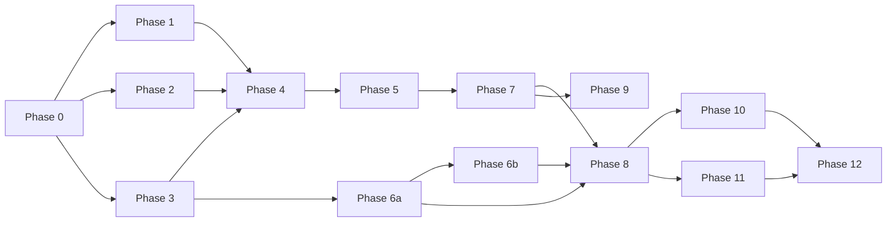

# Lattica — Senior Dev Review
**Date:** 2026-06-11
**Scope:** Pre-code architecture and planning assessment
**Status:** Pre-Phase-0 (documentation only, no implementation)

---

## Overall: B+

Strong architecture, honest planning, exceptional documentation discipline for a solo project. The grade is pulled down by scope ambition that will cause real pain at Phases 6 and 8, a few critical path issues, and some gaps that will bite if not resolved before building starts.

---

## Domain Grades

### Architecture Philosophy — A

The constraint design principle is genuine systems thinking, not buzzword carpeting. "Make mistakes structurally impossible" as a first-class design lens, applied consistently from Policy Scout's tighten-only validation to ES toolkit reducers' type-level purity enforcement to forward-only migrations — this is rare to see articulated this clearly, especially on a solo project. The ADR corpus (8 ADRs, well-reasoned) is far above average quality. The NATS rejection in ADR-002 in particular shows deep understanding of the actual problem space, not just preference.

The registry-over-hardcoded-lists invariant and the source adapter read-only contract are both excellent structural decisions that will prevent entire classes of bugs.

### Event Fabric Design — A-

The 3-table SQLite schema is clean and well-considered. Content-addressed blake3 IDs, branch-as-pointer (not copy), deterministic replay via stored `tool_result` events, pure+synchronous reducers enforced at the type level — these are all correct architectural choices for the stated goals. The stream taxonomy in EVENT_FABRIC.md is well-specified.

One minus: the document creates a subtle ambiguity about napi-rs in Tauri. The webview is not a Node.js environment — it's a browser context. `napi-rs` bindings are Node.js native addons that can't run in a browser webview. EVENT_FABRIC.md later acknowledges "in practice, the frontend uses IPC for most store operations... and uses the napi-rs bindings directly only when running outside Tauri (tests, standalone web page, Storybook)." This needs to be the *leading* description, not a footnote — otherwise Phase 6 Step 5 will produce a TS binding you can't actually use in the primary application path.

### Phase Planning — B+

Confidence calibration is honest: Phase 6 at MEDIUM-LOW, Phase 12 as SPECULATIVE. The critical path (0→1→2→3→4→5→7→9) is identified. Each phase has entry criteria, exit criteria, key risks — that's discipline.

The minuses are real though. See critical items below.

### Documentation — A-

Possibly the best-documented pre-code project at this scale. DESIGN.md covers philosophy, module map, integration topology, the reflective twin, 11 hard invariants, and what success looks like at each milestone. PHASES.md covers 12 phases with full entry/exit criteria. EVENT_FABRIC.md covers the ES toolkit at implementation depth. 8 ADRs with full reasoning. The CLAUDE.md engineering principles (evidence before fix, two-attempt cap, cascade halt) show real operational learning.

Minus: `docs/LATTICA_NOW.md` is referenced as the authoritative live state document in both CLAUDE.md files but it doesn't exist yet. Starting without it means the very first question a collaborating agent asks ("what phase are we in?") has no answer.

### Risk Management — B

Risks are identified at every phase, which is good. Most are real and accurately characterized. But a few are undersold or unresolved:

- SQLite writer contention is flagged as a "known unknown" at Phase 6 but has no mitigation plan. Five Python processes + LumaWeave frontend all writing to `~/.lattica/events.db` under SQLite WAL means writes serialize. Under active development (Policy Scout auditing, Cerebra ingesting, Bo responding) this could produce visible jank. The fallback (per-module files + read-aggregator) would break the unified timeline, which is a core feature.
- The Cerebra cold start is a user-visible problem for all of Phases 3–6. ADR-005 explicitly says "don't build interactive features that require sub-second responses before Phase 7." That's a significant design constraint to carry for 4–5 phases.

### Solo Feasibility — C+

This is where the grade drops. The scope is 2–3 years at solo pace if everything goes well. Phases 0–5 are achievable in a focused 6–9 months. Phase 6 alone (Rust crate + PyO3 + napi-rs + time-travel viewer + bridge adapters + OTel export + module event emission changes across 4 codebases) is easily a 3–4 month phase for one person. Phase 8 requires stable Phase 6, requires integrating live agent emission across active modules (Cerebra, Policy Scout), and produces the most architecturally novel work (live agent visualization). Phases 9–11 pile on after that.

Phase 12 is clearly labeled SPECULATIVE, which is honest. But Phases 8–11 are labeled LOW to MEDIUM confidence while being genuinely large.

---

## Critical Items (Resolve Before Building)

### 1. The Phase 0 Starting Point Is Undefined

The `/Projects/lattica` directory has only docs. LumaWeave's actual code lives elsewhere. ADR-001 says "the LumaWeave codebase becomes Lattica" but the mechanics of this aren't specified anywhere: git subtree? Directory move? Repo rename? This is Phase 0's actual first task and it's absent from the Phase 0 deliverables list.

LumaWeave's Playwright suite references file paths; the test suite CI references the repo. The Phase 0 exit criterion "all existing Playwright E2E tests pass without modification" is only achievable if the migration is handled carefully.

**Resolution needed before Phase 0 begins:** decide and document exactly how LumaWeave's codebase moves into this monorepo structure, and validate the Playwright suite still finds its files on the first pass.

### 2. "Cerebra Phase 5" Is a Ghost Prerequisite

Phase 5 (Reflective Twin v1) lists "Cerebra Phase 5 complete externally: working memory slots must be queryable" as an entry criterion. Phase 9 (Bo Memory Swap) also depends on it. But there is no `cerebra/PHASES.md`, no definition of what "Cerebra Phase 5" means, and no document anywhere in this repo that defines that work.

This is a critical path dependency for Phase 5 that is entirely outside this planning system. If Cerebra Phase 5 isn't tracked, it will slip silently and the blocker will only surface when you're ready to exit Phase 5.

**Resolution:** Either create a `modules/cerebra/PHASES.md` or expand Phase 3 to define the specific Cerebra deliverables that are prerequisites for Phase 5. At minimum, write down what "working memory slots queryable" means as a concrete exit criterion.

### 3. Phase 6 Is Three Phases, Not One

The Phase 6 work breakdown:

- Rust core (weeks 1–2)
- Snapshots (week 2)
- Branches (weeks 3–4)
- PyO3 Python bindings (week 5)
- napi-rs TypeScript bindings (week 6)
- Agent trace adapter (weeks 7–8)
- Time-travel viewer (weeks 9–10)

Plus: bridge adapters for Cerebra and Policy Scout, module event emission for 4+ modules, OTel export, and the cross-module timeline in the System Overview tile.

A 10-week estimate for one person to build a new Rust library with cross-language bindings in two languages, a canvas-based timeline UI, and instrument 4 external codebases is not realistic. Phase 8 hard-blocks on Phase 6. The most compelling demo (agents visually active in the graph) requires Phase 8. Every week Phase 6 slips delays the portfolio differentiator.

**Recommended split:**

- **Phase 6a:** Rust core + snapshots + branches + PyO3 bindings + Cerebra/Policy Scout bridge adapters. Unified event stream is working. Python modules can emit.
- **Phase 6b:** napi-rs bindings + agent trace adapter + time-travel viewer (minimum viable: table view, not canvas). Developer tooling is working.

Phase 8 could proceed after 6a if the Python agent emission side is all that's needed for the initial agent visualization.

### 4. Time-Travel Viewer v1 Should Be a Table, Not a Canvas

The plan describes a canvas-based scrubbable timeline at 60fps rendering 5,000+ events across swim lanes. This is a substantial UI project — building a mini-Grafana from scratch. It's placed at Week 9–10 of a 10-week phase that is already overloaded.

The existing fallback noted in Phase 5 key risks ("a table-based event log with a manual 'replay to this point' button") is exactly the right v1. You get 80% of the value at 20% of the effort. The canvas upgrade is Phase 10+ work where you have real data to design against anyway.

### 5. SQLite Writer Contention Needs a Pre-Phase-6 Decision

The shared `~/.lattica/events.db` approach is architecturally elegant but SQLite serializes writers. Before committing to it, run a synthetic benchmark: 5 threads each appending 100 events/second to the same WAL-mode SQLite file. Measure p99 write latency. If acceptable (<5ms), ship it. If not, the per-module file strategy needs to be Phase 6 scope, not a fallback.

The fallback (per-module SQLite files + read aggregator) is the right answer if contention is real, but it should be the primary design if testing reveals the problem — not an afterthought that breaks the unified timeline story when you flip to it under production load.

---

## High-ROI Low-Effort Improvements

These can all be done before writing a line of implementation code.

**1. Create `LATTICA_NOW.md` immediately.**
It's referenced as the authoritative live state doc in both CLAUDE.md files. Every future agent session starts by checking it. Create it with current phase (pre-Phase-0), current status (all modules independent repos, no monorepo), and the first milestone. Takes 20 minutes, saves confusion on every session start.

**2. Add a phase dependency diagram to PHASES.md.**
A Mermaid graph showing the critical path (0→1→2→3→4→5→7→9, Phase 6 as parallel, Phases 10/11 after 8) makes the sequencing immediately legible without reading prose. All the information is there; the visual is missing.

**3. Formalize the napi-rs/Tauri boundary in EVENT_FABRIC.md.**
Add a callout box at the start of Section 3 (Language Bindings): "Within the Tauri webview, all ES toolkit access routes through Rust backend IPC commands. napi-rs bindings are for tests, tooling, and standalone pages only." This prevents a Phase 6 implementation that builds the bindings and then discovers they can't be used in the actual app.

**4. Add a `lattica-events` package for event payload types.**
A TypeScript package (zero runtime deps, like eval-core) that exports the payload interfaces for all standard event types (`LlmCallPayload`, `ToolResultPayload`, `ReasoningStepPayload`, etc.). This gives the TS side compile-time safety across the IPC boundary at essentially zero cost. Slot it into Phase 6a. Add an equivalent Python dataclass module for the Python side.

**5. Write the `cerebra metrics --format prometheus` contract before Phase 3 begins.**
Specifying the exact metric names (`cerebra_vault_doc_count`, `cerebra_last_ingest_timestamp_seconds`, `cerebra_mean_retrieval_score`, etc.) before implementation means the Grafana dashboard, the Lattica status panel, and the Prometheus scrape config can all be written against the same spec. Two hours now saves coordination overhead across Phase 3.

**6. Add a `type_version` schema registry.**
You have `type_version` on events for schema evolution but no tooling to enforce payload shape compatibility across versions. Even a simple `events/schemas/` directory with one TypeScript type per `(event_type, type_version)` pair, checked by a CI lint step, would catch payload drift before it reaches the event store. This is especially critical for the agent trace standard types (`llm_call`, `tool_result`, etc.) which are cross-module contracts.

**7. Benchmark Cerebra's SQLite WAL under concurrent read/write before Phase 4.**
Phase 4 (Visualization Bridge) adds a polling read adapter against Cerebra's SQLite. Phase 3 has the Discord ingest adapter writing to the same file. Confirm the concurrent access model works at your actual data volumes before Phase 4 depends on it. A 30-minute benchmark script is cheaper than a mid-phase architecture change.

---

## The Central Tension

The most impressive demo (Phase 8: agents visually active in the graph with policy gate edges and time-travel replay) is behind 8 phases of prerequisite work, with Phase 6 being the riskiest single phase. The portfolio motivation is high — this is described repeatedly as the thing that lands in an interview — but the path to the demo is long.

The good news is Phase 5 is also a strong demo: "a local-first platform where AI systems are visible simultaneously in a live graph with physics encoding semantic meaning." That's achievable in 6–9 months from a clean Phase 0 start if Phase 6 is de-scoped as recommended. Phase 5's success story is real and demonstrable without the full ES toolkit.

The architecture is sound. The engineering discipline is excellent. The scope just needs honest calibration so Phase 6 doesn't become the phase that blocks everything else indefinitely.

---

*Companion documents:*
- *`docs/LATTICA_NOW.md` — live state (create this next)*
- *`docs/PHASES.md` — full phase plan with entry/exit criteria*
- *`docs/DESIGN.md` — platform architecture*
- *`docs/EVENT_FABRIC.md` — ES toolkit design*
